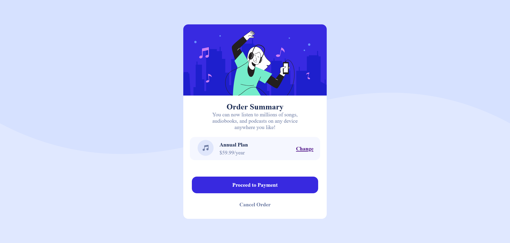

# Frontend Mentor - Order summary card solution

This is a solution to the [Order summary card challenge on Frontend Mentor](https://www.frontendmentor.io/challenges/order-summary-component-QlPmajDUj). Frontend Mentor challenges help you improve your coding skills by building realistic projects. 

## Table of contents

- [Overview](#overview)
  - [The challenge](#the-challenge)
  - [Screenshot](#screenshot)
  - [Links](#links)
- [My process](#my-process)
  - [Built with](#built-with)
  - [What I learned](#what-i-learned)
  - [Continued development](#continued-development)
  - [Useful resources](#useful-resources)
- [Author](#author)
- [Acknowledgments](#acknowledgments)

## Overview

### The challenge

Users should be able to:

- See hover states for interactive elements

### Screenshot


 - Screenshot of the output.

### Links

- Live Site URL: [Live Server Link](https://your-live-site-url.com)

## My process

### Built with

- Semantic HTML5 markup
- CSS custom properties
- Flexbox

### What I learned

I have learned how to make simple templates using HTML and CSS with help of flex properties as well as various hover properties.

Observe below code for given project.

```html
<!DOCTYPE html>
<html lang="en">

<head>
    <meta charset="UTF-8">
    <meta name="viewport" content="width=device-width, initial-scale=1.0">
    <link rel="icon" type="image/png" sizes="32x32" href="./images/favicon-32x32.png">
    <title>Frontend Mentor | Order summary card</title>
    <link rel="stylesheet" href="style.css">
</head>

<body>
    <div id="wrapper">
        <div class="container">
            <div class="card">

                <div class="upper">
                    
                </div>

                <div class="mid">
                    <h2>Order Summary</h2>
                    <br>
                    <p>
                        You can now listen to millions of songs, audiobooks, and podcasts on any
                        device anywhere you like!
                    </p>
                </div>

                <div class=" mid2">
                    <div class="left">
                        <div class="logo">
                            
                        </div>
                        <div class="data">
                            <h4>Annual Plan</h4>
                            <p>$59.99/year</p>
                        </div>
                    </div>
                    <div class="right">
                        <div class="tag">
                            <a href="#">Change</a>
                        </div>
                    </div>
                </div>

                <div class="lower">
                    <div class="button">
                        <button>Proceed to Payment</button>
                    </div>
                    <div class="low-text">
                        <p>Cancel Order</p>
                    </div>
                </div>

            </div>
        </div>
    </div>

    <div class="attribution">
        Challenge by <a href="https://www.frontendmentor.io?ref=challenge" target="_blank">Frontend Mentor</a>.
        Coded by <a href="#">Prasanna Pandhare</a>.
    </div>
</body>

</html>
```
```css
@import url(https://fonts.google.com/specimen/Red+Hat+Display);

* {
    margin: 0;
    padding: 0;
    box-sizing: border-box;
    font-family: "Red Hat Display";
    font-weight: 500, 700, 900;
}

#wrapper {
    height: 100vh;
    width: 100%;
    overflow-x: hidden;
    display: flex;
    justify-content: center;
    align-items: center;
    background-color: hsl(225, 100%, 94%);
    background-image: url(images/pattern-background-desktop.svg);
    background-repeat: no-repeat;
    background-size: contain;
}

.container {
    position: absolute;
    width: 1440px;
    height: 100%;
    display: flex;
    justify-content: center;
    align-items: center;
}

.card {
    display: flex;
    flex-direction: column;
    height: 80%;
    width: 30%;
    border-radius: 15px;
    overflow: hidden;
    background-color: white;
}

.upper img {
    width: 100%;
    height: 100%;
}

.mid {
    display: flex;
    flex-direction: column;
    align-items: center;
}

.mid h2 {
    padding-top: 20px;
    color: hsl(223, 47%, 23%);
}

.mid p {
    color: hsl(224, 23%, 55%);
    text-align: center;
    padding-left: 60px;
    padding-right: 60px;
    font-size: 16px;
}

.mid2 {
    display: flex;
    justify-content: space-between;
    align-items: center;
    height: 70px;
    /* border: 1px dotted cyan; */
    background-color: hsl(225, 100%, 98%);
    padding: 10px;
    margin: 20px;
    border-radius: 15px;
    border: none;
}

.left {
    display: flex;
    justify-content: center;
}

.logo {
    padding: 13px;
}

.data {
    display: flex;
    flex-direction: column;
    gap: 5px;
    justify-content: center;
    padding-left: 5px;
    text-align: justify;
}

.data h4 {
    color: hsl(223, 47%, 23%);
    font-weight: bolder;
}

.data p {
    color: hsl(224, 23%, 55%);
}

.tag {
    padding-right: 10px;
    font-weight: bold;
    /* color: hsl(245, 75%, 52%); */
}

.tag a:hover {
    text-decoration: none;
    color: hsla(245, 75%, 52%, 80%);
}

.lower {
    display: flex;
    flex-direction: column;
    /* padding: 5%; */
    align-items: center;
}

.button {
    padding-top: 30px;
    padding-bottom: 25px;
    display: flex;
    justify-content: center;
    align-items: center;
}

button {
    border: none;
    border-radius: 15px;
    width: 380px;
    height: 50px;
    color: white;
    background-color: hsl(245, 75%, 52%);
    cursor: pointer;
    font-weight: bolder;
    font-size: 16px;
}

button:hover {
    background-color: hsla(245, 75%, 52%, 60%);
}

.low-text {
    color: hsl(224, 23%, 55%);
    font-weight: bold;
    cursor: pointer;
}

.low-text:hover {
    color: hsl(223, 47%, 23%);
}

.attribution {
    font-size: 11px;
    text-align: center;
}

.attribution a {
    color: hsl(228, 45%, 44%);
    text-decoration: none;
}
```

### Continued development

I am trying to improve my skills in media queries.

### Useful resources

- [MDN Docs](https://developer.mozilla.org/en-US/) - Helped me in various learnings. 

## Author

- Website - [Prasanna Pandhare](https://www.your-site.com)
- Frontend Mentor - [@Prasannapandhare](https://www.frontendmentor.io/profile/Prasannapandhare)

## Acknowledgments

I understood the importance of CSS in designing HTML structure.
As well as understood about responsive websites.
